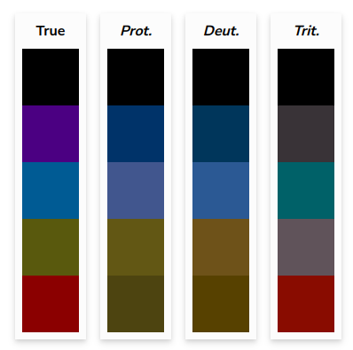

# DDEV Annertech Tools

**Highly opinionated** set of configs and commands used by Annertech in our 
DDEV workflow.

> [!NOTE]
> **This is an Annertech tool!**  
> 3rd party developers and agencies are encouraged to take what they need
> and re-use rather than using the add-on directly.  
> Rapid prototyping and our workflows will not be compatible with yours.  
> Feature requests that you consider important _might_ not be accepted.

## Installation and Updating

1. `ddev add-on get annertech/annertech-ddev`
2. `git commit -m 'Add annertech/annertech-ddev addon'`

## Features

- Provides **host** commands:
- - [`ai` - `ai-prompts`](commands/host/ai-prompts): **Interactive** AI Prompts Operations Centre using CLI version of AI agents
- - [`backstop-public`](commands/host/backstop-public): Copy BackstopJS HTML report into the web root to serve it via the web server
- - [`branch` - `br`](commands/host/branch): Creates an opinionated git branch name from a Teamwork ticket ID
- - [`check-ip`](commands/host/check-ip): Check IP address reputation using AbuseIPDB API
- - [`cloudflare`](commands/host/cloudflare): Shares the project with the outside world over a Cloudflare tunnel
- - [`devmode [on|off]`](commands/host/devmode): Adds custom settings.local.php file and allows easy toggle between production and development mode
- - [`drupal-updater`](commands/host/drupal-updater): Automatically updates Core and Contrib. Usage `drupal-updater -cgado`.
- - [`env-setup`](commands/host/env-setup): Configure project settings (Teamwork board, live/build mode)
- - [`githooks`](commands/host/githooks): Installs git-hooks (also happens on project start)
- - [`glab-mr-link` - `mr-link`](commands/host/glab-mr-link): Opens MR for current branch in browser and copies link to clipboard
- - [`holdmybeer` - `hmb`](commands/host/holdmybeer): Turnkey start to work on a card: Branch, start, pull DB, export config in one go
- - [`lints`](commands/host/lints): Shows available linters and the way to run them
- - [`loghound`](commands/host/loghound): Fast offline Apache access log forensics (5xx, botnets, floods, crawlers, spikes)
- - [`login`](commands/host/login): Opens a browser and logs you in to Drupal (works on local environments only)
- - [`mr`](commands/host/mr): Quickly make a GitLab MR and prefill it
- - [`open-board` - `tw-board`](commands/host/open-board): Open the Teamwork board for this project in the browser
- - [`open-issue` - `tw-open`](commands/host/open-issue): Opens Teamwork issue for current branch
- - [`protect [on|off|reset]`](commands/host/protect): Enable or disable basic auth on a nixsal hosted dev project - [see file](commands/host/protect)
- - [`remote-db`](commands/host/remote-db): Get latest DB from live site
- - [`sanity-check`](commands/host/sanity-check): Sanity-check project settings, configs etc
- - [`tests`](commands/host/tests): Informs about available tests for current project
- - [`timew`](commands/host/timew): Tags current timewarrior tracking with Teamwork ID and project name
- - [`timewarrior-timelog` - `twl`](commands/host/timewarrior-timelog): Log timewarrior summary to a Teamwork task
- - [`travel-mode`](commands/host/travel-mode): Removes all DB dumps downloaded via `ddev pull`, also provides info on how to remove all DDEV projects and their databases
- - [`tw` - `teamwork-operations`](commands/host/teamwork-operations): **Interactive** Teamwork Operations Centre (open-issue, comment, timelog)
- - [`tw-comment` - `comment`](commands/host/tw-comment): Post a comment to a Teamwork task
- - [`tw-description`](commands/host/tw-description): Update Teamwork task description with MR link and deploy/test notes
- - [`tw-new`](commands/host/tw-new): Create a new Teamwork task
- - [`tw-tag-issue` - `tw-tag`](commands/host/tw-tag-issue): Add tags to a Teamwork task
- - [`tw-timelog` - `timelog`](commands/host/tw-timelog): Log time to a Teamwork task (rounded)
- - [`ucc` - `upsun-command-center-bash`](commands/host/upsun-command-center-bash): Upsun Command Centre - interactive mode or with arguments
- - [`upsun-dashboard`](commands/host/upsun-dashboard): Open Upsun project dashboard in browser
- Provides **web container** commands:
- - [`behat`](commands/web/behat): Runs behat
- - [`install-bruno`](commands/web/install-bruno): Prepare bruno configuration
- - [`install-varnish`](commands/web/install-varnish): Installs and configures Varnish on Upsun project. See [Varnish command README](scripts/varnish/README.md)
- - [`phpunit`](commands/web/phpunit): Runs phpunit tests
- - [`platform`](commands/web/platform): Run upsun (ex platform.sh) cli inside the web container
- - [`rector`](commands/web/rector): Run rector automated refactoring inside the web container
- - [`robo`](commands/web/robo): Runs robo
- - [`solr:update-config`](commands/web/solr-update-config): Updates SOLR config.zip
- - [`upsun`](commands/web/upsun): Runs `platform/upsun cli`
- [Adds container bash aliases](scripts/ddev/homeadditions/.bash_aliases) (`ll`, `groot`) and custom purple prompt matching the local environment color
- Uses DDEV Hooks to [properly instantiate project for development](config.annertech.yaml)
- [Adds git hooks](scripts/git-hooks/)
- [Provides GitLab merge request templates](scripts/templates/gitlab/merge_request_templates/) with comprehensive pre-merge checklist
- [Customizes NGINX configuration](nginx)
- Fixes search_api_solr to communicate with local [SOLR](ddev/ddev-drupal-solr) by [default](settings.local.devmode.php#L21) (special overrides might be needed for Pantheon sites)
- [Automatically ignores configuration for development modules](settings.local.devmode.php#L170)

### Automatically disabled

- [Fastly](settings.local.devmode.php#L4$)
- [IP blocking modules](settings.local.devmode.php#L41)
- [Shield](settings.local.devmode.php#L35)
- [TFA](settings.local.devmode.php#L38)

are automatically disabled in the local environment to facilitate development.

## Automatically identified and configured

If your Drupal projects depend on ImageMagick then DDEV will be
automatically configured to compile and use ImageMagick v7 in DDEV. See
`scripts/ddev/web-build` for details.

Upsun is using v7 while DDEV is still running v6 by default.

## Automated Tests for a Project

Use `ddev tests` to see what test suites are available for each project.

## Environment Indicators

Environment indicators in the Drupal Toolbar are tricky because we need to ensure that colors don't conflict with each other and also work with white text.

The following colors should be used:

| Color                                                              | HEX       | Contrast | Environment |
|--------------------------------------------------------------------|-----------|----------|-------------|
|  | `#4A0080` | 13:1     | local, ddev |
|   | `#005B94` | 7:1      | dev         |
|     | `#59590D` | 7:1      | stage       |
|   | `#8B0000` | 10:1     | production  |

This is what people with color vision deficiency see when using the above colors:



> [!NOTE]
>
> Please note that the add-on only controls the local environment color.
> You must fix the rest yourself!

<details>
    <summary>
        Upsun config for SimpleI environment indicator
    </summary>
    <pre><code>
// Per environment settings:
// Configure environment indicator (simplei)
if (isset($platformsh->branch)) {
  // Production type environment.
  if ($platformsh->branch == 'main' || $platformsh->onDedicated()) {
    $settings['simple_environment_indicator'] = '#8B0000 LIVE';
  }
  // Staging type environment
  else if ($platformsh->branch == 'stage') {
    $settings['simple_environment_indicator'] = '#59590D STAGE';
  }
  // Development type environment.
  else {
    $settings['simple_environment_indicator'] = '#005B94 DEV';
  }
}
    </code></pre>
</details>

## External Service Integration

### Teamwork Integration

Several commands integrate with Teamwork (`tw-comment`, `tw-timelog`, `open-issue`, `timew`, `tw-description`). These require the following environment variables to be set on your host machine:

```bash
export TEAMWORK_DOMAIN="projects.yourcompany.com"
export TEAMWORK_API_KEY="your_api_key_here"
```

Add these to your `~/.bashrc` or `~/.zshrc` file.

### IP Reputation Checking

The `check-ip` command uses AbuseIPDB API and requires:

```bash
export ABUSEIPDB_API_KEY="your_api_key_here"
```

Add this to your `~/.bashrc` or `~/.zshrc` file.

### AI Prompts

The `ai-prompts` command provides interactive AI-powered workflows and requires at least one of:
- [Gemini CLI](https://geminicli.com/) - `gemini` command
- [GitHub Copilot CLI](https://docs.github.com/en/copilot/concepts/agents/about-copilot-cli) - `copilot` command
- [Claude Code](https://github.com/anthropics/claude-code) - `claude` command

Install at least one of these tools on your host machine. The command will prompt you to select which AI agent to use when run.

## Tricks

Handy shell aliases to add to your **host** machine:
```
# DDEV
alias composer='ddev composer'
alias behat='ddev behat'
alias drush='ddev drush'
alias platform='ddev platform'
alias upsun='ddev upsun'
alias upsunactlog='ddev exec upsun act:log --state=in_progress'
alias robo='ddev robo'

alias xe='ddev xdebug enable'
alias xd='ddev xdebug disable'
alias xt='status=$(ddev xdebug status) &&  if [ "$status" == "xdebug enabled" ]; then ddev xdebug off; else ddev xdebug on; fi'

# Tailscale
alias exit-node-on='tailscale set --exit-node="your.exit.node.ts.net"'
alias exit-node-off='tailscale set --exit-node=""'

# TeamWork
export TEAMWORK_DOMAIN=_DOMAIN_
export TEAMWORK_API_KEY=_KEY_
alias t-snt='/path/to/annertech-ddev/commands/host/timelog -u -t _TICKET_ID_ 15 "SNT"'
alias t-scrum='/path/to/annertech-ddev/commands/host/timelog -u -t _TICKET_ID_ 15 "Scrum"'
alias t-retro='/path/to/annertech-ddev/commands/host/timelog -u -t _TICKET_ID_ 60 "Retro"'
```

### git and tig

#### git

**linked-log (`git llog`):** Link `git log` commits to teamwork cards:
```
git config --global alias.llog '!f() { git log --color=always --pretty=format:"%Cred%h%Creset %Creset%s%Creset %Cgreen(%cr) %C(bold blue)<%an>%Creset" "$@" | sed -E "s|T-([0-9]+)|\x1b[36mT-\1\x1b[0m (\x1b[37mhttps://projects.annertech.com/app/tasks/\1\x1b[0m)|g" | less -FRX; }; f'
```

#### tig

- **Link commits to cards:** Open card of selected commit by pressing `o` in your keyboard:
- Copy commit hash with `y` (yank)

`~/.tigrc`

```
# Open ticket in browser (cross-platform)
bind main o @sh -c "git log -1 --format='%s' '%(commit)' | grep -oP 'T-\\d+' | sed 's/T-//' | xargs -I{} sh -c 'xdg-open \"https://projects.annertech.com/app/tasks/{}\" 2>/dev/null || open \"https://projects.annertech.com/app/tasks/{}\" 2>/dev/null || start \"https://projects.annertech.com/app/tasks/{}\"'"
bind diff o @sh -c "git log -1 --format='%s' '%(commit)' | grep -oP 'T-\\d+' | sed 's/T-//' | xargs -I{} sh -c 'xdg-open \"https://projects.annertech.com/app/tasks/{}\" 2>/dev/null || open \"https://projects.annertech.com/app/tasks/{}\" 2>/dev/null || start \"https://projects.annertech.com/app/tasks/{}\"'"

# Copy commit hash to clipboard (cross-platform)
bind main y @sh -c "echo -n '%(commit)' | xclip -selection clipboard 2>/dev/null || echo -n '%(commit)' | pbcopy 2>/dev/null || echo -n '%(commit)' | clip.exe 2>/dev/null
```


## Common Problems and How-To Fix Them

### commit-msg hook is ignored

Check `git config -l` for the value of `core.hooksPath` and can change it to the local path with

```
git config --local core.hooksPath .git/hooks
```
