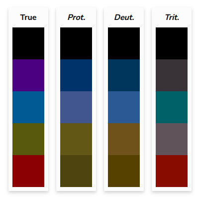

# DDEV Annertech Tools

**Highly opinionated** set of configs and commands used by Annertech in our 
DDEV workflow.

## Installation and Updating

1. `ddev add-on get annertech/annertech-ddev`
2. `git commit -m 'Add annertech/annertech-ddev addon'`

## Features

- Provides **global** commands (available in all projects, project level commands below take priority):
- - [`branch`](commands/host/branch): Creates an opinionated git branch name from a Teamwork ticket ID
- - [`cloudflare`](commands/host/cloudflare): Shares the project with the outside world over a Cloudflare tunnel
- - [`drupal-updater`](commands/host/drupal-updater): Automatically updates Core and Contrib. Usage `drupal-updater -cugado`.
- - [`login`](commands/host/login): Opens a browser and logs you in to Drupal (works on local environments only)
- - [`open-issue`](commands/host/open-issue): Opens teamwork issue for current branch
- - [`timeslip`](commands/host/timeslip): Generates a timeslip message for FreeAgent. If `timewarrior` is installed it will also show the sum of time spent today
- - [`timew`](commands/host/timew): Tags current timewarrior tracking with Teamwork link and project name
- - [`travel-mode`](commands/host/travel-mode): Removes all DB dumps 
    downloaded via `ddev pull`, also provides info on how to remove all DDEV 
    projects and their databases
- Provides **host** commands:
- - [`branch`](commands/host/branch): Creates an opinionated git branch name from a Teamwork ticket ID
- - [`cloudflare`](commands/host/cloudflare): Shares the project with the outside world over a Cloudflare tunnel
- - [`devmode [on|off]`](commands/host/devmode): Adds custom settings.local.php file and allows easy toggle between production and development mode
- - [`drupal-updater`](commands/host/drupal-updater): Automatically updates Core and Contrib. Usage `drupal-updater -cugado`.
- - [`githooks`](commands/host/githooks): Installs git-hooks (also happens on project start)
- - [`lints`](commands/host/lints): Shows available linters and the way to run them
- - [`login`](commands/host/login): Opens a browser and logs you in to Drupal (works on local environments only)
- - [`protect [on|off|reset]`](commands/host/protect): Enable or disable basic auth on a nixsal hosted dev project - [see file](commands/host/protect)
- - [`tests`](commands/host/tests): Informs about available tests for current project
- - [`timeslip`](commands/host/timeslip): Generates a timeslip message for FreeAgent. If `timewarrior` is installed it will also show the sum of time spent today
- Provides **web container** commands:
- - [`behat`](commands/web/behat): Runs behat
- - [`install-varnish`](commands/web/install-varnish): Installs and configures Varnish on platform.sh project. See [Varnish command README](scripts/varnish/README.md)
- - [`upsun`](commands/web/platform): Runs `platform/upsun cli`
- - [`robo`](commands/web/robo): Runs robo
- - [`solr:update-config`](commands/web/solr-update-config): Updates SOLR config.zip
- - [`phpunit`](commands/web/phpunit): Runs phpunit tests
- Uses DDEV Hooks to [properly instantiate project for development](config.hooks.yaml)
- [Adds git hooks](scripts/git-hooks/)
- [Sets to development mode on project start](config.annertech.yaml#L3)
- [Customizes NGINX configuration](nginx)
- Fixes search_api_solr to communicate with local [SOLR](ddev/ddev-drupal-solr) by [default](settings.local.devmode.php#L21) (special overrides might be needed for Pantheon sites)
- [Automatically ignores configuration for development modules](settings.local.devmode.php#L170)

### Automatically disabled

- [Fastly](settings.local.devmode.php#L4$)
- [IP blocking modules](settings.local.devmode.php#L41)
- [Shield](settings.local.devmode.php#L35)
- [TFA](settings.local.devmode.php#L38)

are automatically disabled in local environment to facilitate development.

## Automatically identified and configured

If your Drupal projects depend on ImageMagick then DDEV will be
automatically configured to compile and use ImageMagick v7 in DDEV. See
`scripts/ddev/web-build` for details.

Platform.sh is using v7 while DDEV is still running v6 by default.

## Automated Tests for a Project

Use `ddev tests` to see what test suites are available for each project.

## Environment Indicators

Environment indicators in the Drupal Toolbar are tricky because we need to ensure that colors don't conflict with each other and also work with white text.

The following colors should be used:

| Color                                                              | HEX       | Contrast | Environment |
|--------------------------------------------------------------------|-----------|----------|-------------|
|  | `#4A0080` | 13:1     | local, ddev |
|   | `#005B94` | 7:1      | dev         |
|     | `#59590D` | 7:1      | stage       |
|   | `#8B0000` | 10:1     | production  |

This is what people with color vision deficiency see when using the above colors:



> [!NOTE]
>
> Please note that the add-on only controls the local environment color.
> You must fix the rest yourself!

<details>
    <summary>
        Platform.sh config for SimpleI environment indicator
    </summary>
    <pre><code>
// Per environment settings:
// Configure environment indicator (simplei)
if (isset($platformsh->branch)) {
  // Production type environment.
  if ($platformsh->branch == 'main' || $platformsh->onDedicated()) {
    $settings['simple_environment_indicator'] = '#8B0000 LIVE';
  }
  // Staging type environment
  else if ($platformsh->branch == 'stage') {
    $settings['simple_environment_indicator'] = '#59590D STAGE';
  }
  // Development type environment.
  else {
    $settings['simple_environment_indicator'] = '#005B94 DEV';
  }
}
    </code></pre>
</details>

## Tricks

Handy shell aliases to add to your **host** machine:
```
# DDEV
alias composer='ddev composer'
alias behat='ddev behat'
alias drush='ddev drush'
alias platform='ddev platform'
alias upsun='ddev upsun'
alias robo='ddev robo'

alias xe='ddev xdebug enable'
alias xd='ddev xdebug disable'
alias xt='status=$(ddev xdebug status) &&  if [ "$status" == "xdebug enabled" ]; then ddev xdebug off; else ddev xdebug on; fi' 
```

## Common Problems and How-To Fix Them

### commit-msg hook is ignored

Check `git config -l` for the value of `core.hooksPath` and can change it to the local path with

```
git config --local core.hooksPath .git/hooks
```
